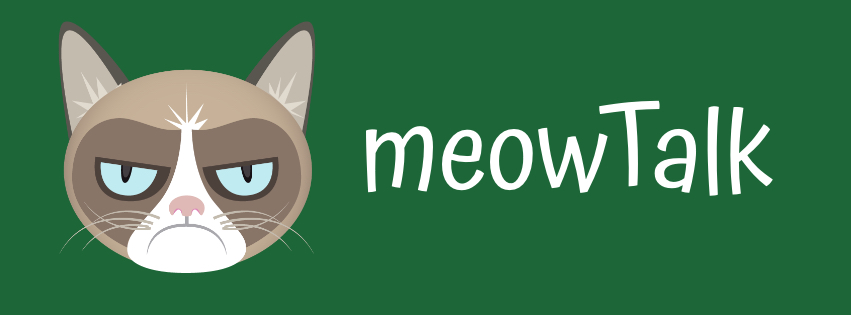

## My Inspiration:
Cats do not have owners; they have butlers but they are incredibly sensitive and loyal. meowTalk is a mobile app that lets such butlers chat together.

## Try Out the App:
If you want to test this app, the prerequisite is that you have Expo installed on your device.

While our app is in development, beta testers can try it out by cloning this repo, using the terminal to navigate to the main directory, running "npm install" and then running "npm start". The start script will then open Expo where you will be prompted to view in the simulator of your choice.

An alternate to running the app in a simulator is to install Expo on a mobile device, run the start script from the terminal, and then scan the QR code. As you onboard, you will be prompted to allow the app to access your location. To get the most from myFlock, please grant this permission.

## Overview of Features:

 Once you are signed up and logged in, you will have access to the following functions:

- Home: A list of all chat rooms available.
- Chat Rooms: Individual chats persist for small groups to discuss cat butler needs.
- Add Chat: Vibe with another butler or have a specific need? Create a new chat room and problem solve!

## Tech Stack:

- Back End:
  - FireBase
    - handles user authentication and a noSQL database.
- Front End:
  - Expo
    - enables speedy development that is compatible with iOS devices
  - React Native
    - react hooks
- Design Tools:
  - HTML
  - CSS

## Future Considerations:

    Groups based on topics
    User profiles include cat data

## Developer:
 - Victoria Lee ( [LinkedIn](https://www.linkedin.com/in/victoria-lee-dev/) | [GitHub](https://github.com/dalgonaio) )
